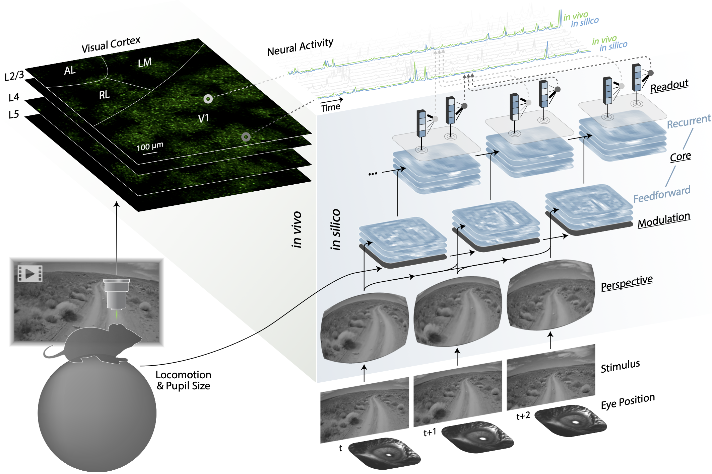

# Foundation model of neural activity predicts response to new stimulus types and anatomy

[[`Paper`](https://doi.org/10.1101/2023.03.21.533548)] [[`BibTeX`](#Citation)]

Eric Y Wang, Paul G Fahey, Zhuokun Ding, Stelios Papadopoulos, Kayla Ponder, Marissa A Weis, Andersen Chang, Taliah Muhammad, Saumil Patel, Zhiwei Ding, Dat Tran, Jiakun Fu, Casey M Schneider-Mizell, R Clay Reid, Forrest Collman, Nuno Maçarico da Costa, Katrin Franke, Alexander S Ecker Jacob Reimer, Xaq Pitkow, Fabian H Sinz, Andreas S Tolias

## Model Overview

<p align="center">
</img>
</p>

Model of the visual cortex. The left panel (green) depicts an *in vivo* recording session of excitatory neurons from several areas (V1, LM, RL, AL) and layers (L2/3, L4, L5) of the mouse visual cortex. The right panel (blue) shows the architecture of the model and the flow of information from inputs (visual stimulus, eye position, locomotion, and pupil size) to outputs (neural activity). Underlined labels denote the four main modules of the model: perspective, modulation, core, and readout. For the modulation and core, the stacked planes represent feature maps. For the readout, the blue boxes represent the core’s output features at the readout position of the neuron, and the fanning black lines represent readout feature weights. The top of the schematic displays the neural activity for a sampled set of neurons. For two example neurons, *in vivo* and *in silico* responses are shown (green and blue, respectively).

## Requirements

###  Hardware

CPU-only support is available, but a modern GPU is recommended (tested on NVIDIA 3090, V100, A10, A100).

### Software

This package is written for Python (3.8+) and is supported on Linux (tested on Ubuntu 18.04, 20.04, 22.04, 24.04).

## Installation

```bash
pip install git+https://github.com/cajal/fnn.git
```

## Usage

```python
from fnn import microns
from numpy import full, concatenate

# load the model and neuron ids of the MICrONS scan 8-5
model, ids = microns.scan(session=8, scan_idx=5)

# example 3-second video (3 x 30 frames @ 30 FPS, 144 height, 256 width)
frames = concatenate([
    full(shape=[30, 144, 256], dtype="uint8", fill_value=0),   # 1 second of black
    full(shape=[30, 144, 256], dtype="uint8", fill_value=128), # 1 second of gray
    full(shape=[30, 144, 256], dtype="uint8", fill_value=255), # 1 second of white
])

# predict the response of neurons to the 3-second video
response = model.predict(stimuli=frames)
```

## Citation

If you find this repository useful, please cite using this BibTeX:

```bibtex
@article{wang2025foundation,
  title={Foundation model of neural activity predicts response to new stimulus types},
  author={Wang, Eric Y. and Fahey, Paul G. and Ding, Zhuokun and Papadopoulos, Stelios and Ponder, Kayla and Weis, Marissa A. and Chang, Andersen and Muhammad, Taliah and Patel, Saumil and Ding, Zhiwei and Tran, Dat and Fu, Jiakun and Schneider-Mizell, Casey M. and Reid, R. Clay and Collman, Forrest and da Costa, Nuno Ma{\c c}arico and Franke, Katrin and Ecker, Alexander S. and Reimer, Jacob and Pitkow, Xaq and Sinz, Fabian H. and Tolias, Andreas S.},
  journal={Nature},
  volume={640},
  number={8058},
  pages={470--477},
  year={2025},
  publisher={Nature Publishing Group UK London},
  doi={10.1038/s41586-025-08829-y}
}
```
